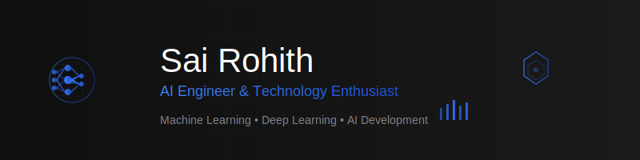

<div align="center">
  
</div>

<div align="center">
  
  
  [](https://github.com/sairohith28)
  [](https://www.linkedin.com/in/sai-rohith-vulapu/)
  
</div>

---

## 🚀 About Me

```python
class SaiRohith:
    def __init__(self):
        self.name = "Sai Rohith Vulapu"
        self.role = "AI Engineer & Data Scientist"
        self.location = "India 🇮🇳"
        self.current_focus = "Semantic Segmentation & Neural Networks"
        self.learning = ["GCP", "Hadoop", "Advanced Deep Learning"]
        self.interests = ["Computer Vision", "NLP", "MLOps"]
        
    def get_daily_routine(self):
        return {
            "morning": "☕ Coffee + 📚 Research Papers",
            "afternoon": "💻 Building AI Models",
            "evening": "✍️ Writing Technical Blogs",
            "night": "🧠 Learning New Technologies"
        }
        
    def life_philosophy(self):
        return "Future unfolds, past escapes, seize today. 🌟"
```

---

## 🎯 Current Focus

<table>
<tr>
<td width="50%">

### 🔬 What I'm Working On
- 🧠 **Semantic Segmentation** research
- 🤖 **Neural Network** optimization
- 📊 **Computer Vision** applications
- ☁️ **MLOps** with GCP

</td>
<td width="50%">

### 🌱 What I'm Learning
- **Google Cloud Platform** ☁️
- **Apache Hadoop** 🐘
- **Advanced Deep Learning** 🧠
- **Research Methodologies** 📚

</td>
</tr>
</table>

---

## 🛠️ Tech Arsenal

<div align="center">

### 🧠 AI/ML Stack


### ☁️ Cloud & DevOps


### 💻 Development


### 🗄️ Databases


</div>

---

## 📊 GitHub Analytics

<div align="center">
  
  
</div>

<div align="center">
  
</div>

<div align="center">
  
</div>

---

## 🌐 Connect With Me

<div align="center">

[](https://www.linkedin.com/in/sai-rohith-vulapu/)
[](https://medium.com/@vulapusairohith28)
[](https://www.kaggle.com/hitty28)
[](https://instagram.com/sai_rohith_2812)
[](mailto:vulapusairohith28@gmail.com)

</div>

---

## 📝 Latest Blog Posts

<div align="center">
  
[](https://medium.com/@vulapusairohith28)

</div>

---

## 🎯 Goals for 2025

```yaml
Research:
  - Complete semantic segmentation project
  - Publish research paper on neural networks
  - Contribute to open-source AI projects

Learning:
  - Master Google Cloud Platform
  - Deep dive into Apache Hadoop
  - Explore Large Language Models

Collaboration:
  - Work with AI research teams
  - Mentor aspiring data scientists
  - Build innovative AI solutions
```

---


<div align="center">

🎯 **Ask me about:** TensorFlow, Deep Learning, Computer Vision  
🔬 **Research Interest:** Neural Networks & Semantic Segmentation  
📚 **Philosophy:** "Future unfolds, past escapes, seize today."  
☕ **Fuel:** Coffee + Curiosity + Code  

</div>

---

<div align="center">
  
### 🌟 "Building AI solutions that make tomorrow better than today"


</div>

<div align="center">
  
</div>
